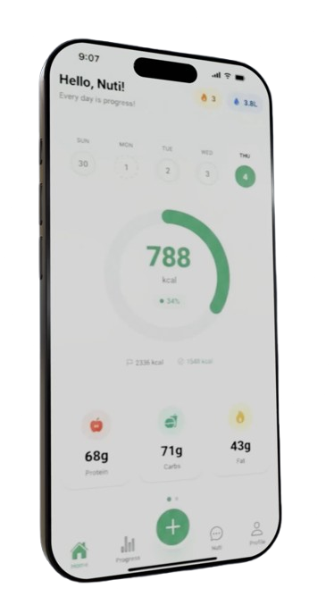

# Nuti - App Mobile

App mobile nativa desenvolvida com Expo + React Native + NativeWind + Firebase + Groq API.

<p align="center">
   
</p>


## 🚀 Tech Stack

- **Framework**: React Native with Expo
- **Styling**: NativeWind (Tailwind for React Native)
- **Database**: Firebase Firestore
- **Authentication**: Firebase Authentication (email + Google Sign-In)
- **Global State**: Context API + AsyncStorage
- **External APIs**:
   - Groq API for AI chat (mixtral-8x7b model)
   - Open Food Facts API for food search
- **Push Notifications**: expo-notifications
- **Camera & Barcode**: expo-camera + expo-barcode-scanner
- **Animations**: react-native-reanimated and moti
- **Navigation**: @react-navigation/native-stack


## 📦 Installation

1. Install dependencies:
```bash
cd mobile
npm install
```

2. Configure environment variables:
Copy the `.env.example` file to `.env` in the `mobile/` folder and fill in your credentials:
```
cp .env.example .env
```
**Never commit your real `.env` file to a public repository!**


**Important - Google Sign-In Configuration:**
1. Go to the [Google Cloud Console](https://console.cloud.google.com/)
2. Create a new project or select an existing one
3. Enable the "Google+ API" or "Google Identity" API
4. Go to "Credentials" > "Create Credentials" > "OAuth 2.0 Client ID"
5. Select "Web Application" as the type
6. Add the following authorized redirect URIs:
   - For Expo Go: `https://auth.expo.io/@your-expo-username/nuti`
   - For local development: `https://auth.expo.io/@anonymous/nuti`
   - (Expo automatically generates the correct URI at runtime)
7. Copy the "Client ID" and paste it into `EXPO_PUBLIC_GOOGLE_WEB_CLIENT_ID` in your `.env`
8. In the Firebase Console, go to Authentication > Sign-in method > Google
9. Enable the Google sign-in method and use the same Client ID from step 7
10. Add the same Client ID in the "Web SDK configuration"


3. Start the project:
```bash
npm start
```

## 🏗️ Project Structure

```
mobile/
├── App.tsx                 # Main app component
├── screens/                # Application screens
│   ├── LoginScreen.tsx
│   ├── RegisterScreen.tsx
│   ├── DashboardScreen.tsx
│   ├── AddMealScreen.tsx
│   ├── ChatScreen.tsx
│   ├── ProfileScreen.tsx
│   └── PremiumOnboardingScreen.tsx
├── components/             # Reusable components
│   ├── MealCard.tsx
│   ├── BadgeItem.tsx
│   └── ChartCircle.tsx
├── services/               # Services and APIs
│   ├── firebase.ts
│   ├── api.ts
│   └── gamification.ts
├── context/                # Context API
│   └── UserContext.tsx
├── utils/                  # Utilities
│   ├── streakUtils.ts
│   └── formatters.ts
└── assets/                 # Assets (images, icons)
```

## 🔥 Features

### Authentication
- Login and registration with email/password
- Google Sign-In support
- Session management with AsyncStorage

### Dashboard
- Circular chart for calories consumed / daily goal
- List of recent meals
- Current streak (consecutive days)
- Unlocked badges
- Floating button to add a meal

### Meals
- Food search (Open Food Facts API)
- Take meal photo (expo-camera)
- Barcode scanning (expo-barcode-scanner)
- Save meal to Firestore

### AI Chat
- Interactive chat with AI via Groq API
- History saved in Firestore
- Message limit for free users (5/day)
- Unlimited for Premium users

### Gamification
- Streaks: +1 day if ≥3 meals registered

   - Automatic badges:
      - First Meal
      - 3 Days in a Row
      - Perfect Week (7 days)
      - Perfect Month (30 days)
      - 10 Meals
      - 50 Meals


### Profile
- View and edit personal data
- View streak and badges
- Activate Premium (simulation)


## 🏗️ Testing on Android

### Option 1: Expo Go (Faster - Recommended for getting started)

1. **Install Expo Go on your Android phone** (Google Play Store)

2. **Start the server:**
```bash
cd mobile
npm start
```

3. **Connect your phone:**
   - Make sure your phone and computer are on the same Wi-Fi network
   - Scan the QR code with Expo Go OR
   - Enter the URL manually in Expo Go

4. **Google Sign-In works automatically** via web proxy (no SHA-1 needed)

### Option 2: Dev Client (Full Experience - For production)

**To enable native Google Sign-In, you need the SHA-1:**

**Windows:**
```powershell
cd mobile/android
./get-sha1.ps1
```


**Linux/Mac:**
```bash
cd mobile/android
chmod +x get-sha1.sh
./get-sha1.sh
```

**Manual:**
```bash
cd mobile/android/app
keytool -list -v -keystore debug.keystore -alias androiddebugkey -storepass android -keypass android
```

**Then configure in Google Cloud Console:**
1. Create OAuth 2.0 Client ID (Android type)
2. Package name: `com.nuti.app`
3. SHA-1: (paste the SHA-1 obtained)
4. Add `EXPO_PUBLIC_GOOGLE_ANDROID_CLIENT_ID` to your `.env`

**Dev Client Build:**

**Local (requires Android Studio):**
```bash
cd mobile
npx expo run:android
```

**With EAS (easier):**
```bash
npm install -g eas-cli
eas login
cd mobile
eas build --platform android --profile development
```

📖 **Full guide:** See `TESTE_ANDROID.md` for detailed instructions

## 📝 Important Notes

1. **Firebase**: Set up your Firebase project and add credentials to `.env`
2. **Groq API**: Get your API key at https://console.groq.com
3. **Google Sign-In**: 
   - For Expo Go: Uses Expo proxy (`auth.expo.io`) - works automatically with `EXPO_PUBLIC_GOOGLE_WEB_CLIENT_ID`
   - For dev-client/standalone: Can use native login (requires additional setup in Google Console)
   - The redirect URI is generated automatically by Expo at runtime
   - Make sure the same Client ID is configured in the Firebase Console
4. **Badges**: Badges are initialized automatically on first run
5. **Environment Variables**: Never commit the `.env` file - use `.env.example` as a reference

## 🎨 Theme

- Primary color: Green (#3BB273)
- Light/dark mode: Automatic based on system
- Modern and fluid UI with smooth animations

## 📱 Requirements

- Node.js 18+
- Expo CLI
- Android Studio (for Android builds)
- Expo account (for EAS Build)

## 🔐 Security

- Never commit the `.env` file
- Keep API keys secure
- Use environment variables for all credentials

## 📄 License

Private project - All rights reserved

